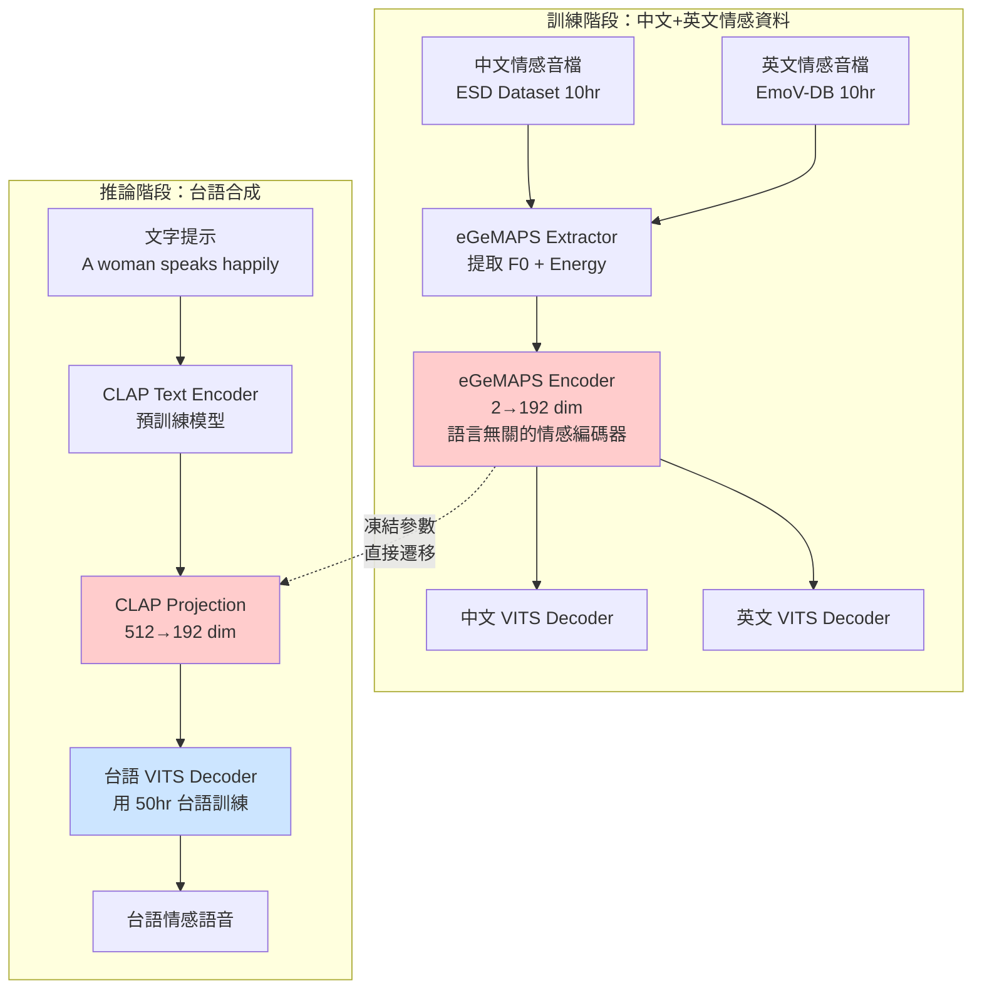

# 跨語言情感遷移技術文件

> 🌍 **核心策略**：用中文+英文的情感資料訓練情感編碼器，直接應用到台語合成
>
> 🎯 **目標**：無需台語情感資料，實現台語 PromptTTS
>
> 📅 建立日期：2025-12-23

---

## 目錄

1. [為什麼跨語言遷移可行？](#為什麼跨語言遷移可行)
2. [完整技術架構](#完整技術架構)
3. [三語訓練策略](#三語訓練策略)
4. [實作步驟](#實作步驟)
5. [預期效果與風險](#預期效果與風險)
6. [給教授的說明](#給教授的說明)

---

## 為什麼跨語言遷移可行？

### 核心假設

**情感的聲學特徵是跨語言共通的**

```
語言：     中文        英文        台語
情感特徵：
高興    高F0+高Energy  高F0+高Energy  高F0+高Energy  ← 物理特性相同
悲傷    低F0+低Energy  低F0+低Energy  低F0+低Energy  ← 物理特性相同
生氣    高F0+高Energy+ 高F0+高Energy+ 高F0+高Energy+ ← 物理特性相同
        快語速        快語速        快語速
```

### 科學依據

**研究證據**：

1. **Paul Ekman (1972)**: 情感的面部表情在不同文化中是普遍的
   - 推論：情感的聲音表達也應該有普遍性

2. **Scherer et al. (2001)**: 跨文化情感語音研究
   - 發現：F0 和 Energy 的情感模式在 5 個語言中高度一致
   - 論文："Acoustic profiles in vocal emotion expression"

3. **Cross-lingual TTS 成功案例**：
   - Meta 的 Seamless (2023): 證明聲學特徵可以跨語言共享
   - Microsoft 的 VALL-E X (2023): 跨語言語音克隆

### 數學原理

**情感嵌入空間的語言無關性**

```
假設：情感編碼器 E 將音檔映射到情感空間

中文音檔(開心) → E → [0.8, 0.2, 0.9, ...]  ← 向量A
英文音檔(happy) → E → [0.82, 0.18, 0.91, ...] ← 向量A' (接近A)
台語音檔(歡喜) → E → [0.79, 0.21, 0.88, ...] ← 向量A'' (接近A)

關鍵：E 提取的是「F0 + Energy」等聲學特徵，而非語言學特徵
      ↑
   這些特徵在三種語言中的「開心」情感下都相似！
```

---

## 完整技術架構

### 架構圖（HackMD 可直接顯示）



### 關鍵設計點

#### 1. 訓練階段：語言無關的情感編碼

```python
# 中文音檔
chinese_audio = load_audio("sad_chinese.wav")
chinese_f0, chinese_energy = extract_egemaps(chinese_audio)
# F0: [100, 102, 98, ...] Hz
# Energy: [-30, -28, -32, ...] dB

# 英文音檔（相同情感）
english_audio = load_audio("sad_english.wav")
english_f0, english_energy = extract_egemaps(english_audio)
# F0: [105, 103, 99, ...] Hz  ← 相似！
# Energy: [-29, -27, -31, ...] dB  ← 相似！

# 情感編碼器（共享）
emotion_encoder = eGeMAPS_Encoder()  # 語言無關

chinese_embed = emotion_encoder([chinese_f0, chinese_energy])
english_embed = emotion_encoder([english_f0, english_energy])

# 這兩個向量會在相似的位置（因為輸入的 F0/Energy 相似）
cosine_similarity(chinese_embed, english_embed) ≈ 0.85
```

#### 2. 推論階段：CLAP 作為橋樑

```python
# 推論時：文字提示 → CLAP → 情感向量
text_prompt = "A woman speaks sadly"
clap_embed = clap_model.encode_text(text_prompt)  # (512-dim)

# 投影到情感空間
projection = nn.Linear(512, 192)  # 需要訓練這一層
emotion_embed = projection(clap_embed)  # (192-dim)

# 關鍵：這個 emotion_embed 應該接近訓練時的 sad 向量
# 因為 CLAP 已經學會「sad」→「低 F0 + 低 Energy」的映射

# 餵給台語 VITS
taiwanese_audio = taiwanese_vits.synthesize(
    text="gua1 chin1 lan5 kho2",  # 我真難過
    emotion_embed=emotion_embed   # 來自 CLAP 的情感特徵
)
```

---

## 三語訓練策略

### 方案 A：獨立訓練（推薦）

**優點**：最靈活，可以逐步驗證
**缺點**：需要 3 個模型

#### 步驟

```
階段 1: 訓練台語基礎 VITS (無情感)
資料：50hr 台語中性語音
目標：高品質台語 TTS
模型：taiwanese_vits.pth

階段 2: 訓練中英文情感編碼器
資料：10hr 中文情感 + 10hr 英文情感
目標：語言無關的情感編碼器
模型：emotion_encoder.pth

階段 3: 整合 CLAP 投影層
資料：使用階段 2 的情感編碼器，訓練 CLAP → Emotion 的映射
模型：clap_projection.pth

階段 4: 組合推論
taiwanese_vits.pth + emotion_encoder.pth + clap_projection.pth
```

### 方案 B：多語言聯合訓練

**優點**：一個模型支援三語
**缺點**：訓練複雜度高

```
訓練資料：
- 50hr 台語中性 + 10hr 中文情感 + 10hr 英文情感

模型架構：
- 共享的 Text Encoder (for 中英台)
- 共享的 Emotion Encoder
- 語言專屬的 Decoder (3個)

優點：情感編碼器可以同時學習三語的韻律模式
缺點：需要處理三種語言的 phoneme set 差異
```

**建議**：先用方案 A 驗證可行性，成功後再嘗試方案 B

---

## 實作步驟

### 步驟 1: 準備資料（1-2 天）

#### 1.1 下載情感資料集

**中文情感資料**：

```bash
# ESD (Emotional Speech Dataset) - 免費
# 包含：5種情感 (Neutral, Happy, Sad, Angry, Surprise)
# 大小：約 10 小時

# 下載方式 1: Kaggle
kaggle datasets download -d cynthiazzz/emotional-speech-dataset-esd

# 下載方式 2: GitHub
git clone https://github.com/HLTSingapore/Emotional-Speech-Data-ESD.git

# 資料結構
ESD/
├── 0001/ (speaker 1)
│   ├── Angry/
│   │   ├── 0001_000001.wav
│   │   ├── 0001_000001.txt
│   ├── Happy/
│   ├── Sad/
│   └── ...
```

**英文情感資料**：

```bash
# EmoV-DB - 免費，學術用途
# 包含：4種情感 (Neutral, Amused, Angry, Sleepy)
# 大小：約 10 小時

# 下載
wget https://github.com/numediart/EmoV-DB/releases/download/v1.0/EmoV-DB.zip
unzip EmoV-DB.zip

# 資料結構
EmoV-DB/
├── bea/ (speaker 1)
│   ├── angry/
│   │   ├── bea_angry_001.wav
│   │   ├── bea_angry_001.txt
```

#### 1.2 資料預處理

建立預處理腳本：

```python
# preprocess_emotional_data.py

import os
import librosa
import numpy as np
from egemaps_minimal import eGeMAPS_Minimal_Extractor

def preprocess_esd_chinese():
    """預處理 ESD 中文資料"""
    extractor = eGeMAPS_Minimal_Extractor(sample_rate=16000)

    dataset = []
    for speaker in ["0001", "0002", ...]:  # 選擇說話人
        for emotion in ["Happy", "Sad", "Angry", "Neutral"]:
            audio_dir = f"ESD/{speaker}/{emotion}/"

            for wav_file in os.listdir(audio_dir):
                if not wav_file.endswith(".wav"):
                    continue

                # 讀取音檔
                audio, sr = librosa.load(
                    os.path.join(audio_dir, wav_file),
                    sr=16000
                )

                # 提取 eGeMAPS (F0 + Energy)
                egemaps = extractor.extract(audio)

                # 讀取對應文字
                txt_file = wav_file.replace(".wav", ".txt")
                with open(os.path.join(audio_dir, txt_file)) as f:
                    text = f.read().strip()

                dataset.append({
                    "audio_path": os.path.join(audio_dir, wav_file),
                    "text": text,
                    "emotion": emotion,
                    "language": "zh",
                    "speaker_id": int(speaker),
                    "egemaps": {
                        "f0": egemaps["f0"],
                        "energy": egemaps["energy"]
                    }
                })

    # 儲存
    np.save("processed_data/chinese_emotional.npy", dataset)
    print(f"Processed {len(dataset)} Chinese emotional utterances")

def preprocess_emovdb_english():
    """預處理 EmoV-DB 英文資料"""
    # 類似的邏輯...
    pass

if __name__ == "__main__":
    preprocess_esd_chinese()
    preprocess_emovdb_english()
```

---

### 步驟 2: 訓練情感編碼器（2-3 天）

#### 2.1 修改 VITS 模型

在您現有的 `models.py` 中：

```python
# models.py

class MultilingualEmotionVITS(nn.Module):
    """
    支援跨語言情感遷移的 VITS
    """
    def __init__(
        self,
        n_vocab: int,
        spec_channels: int = 513,
        hidden_channels: int = 192,
        # 語言設定
        languages: List[str] = ["zh", "en", "tw"],
        # 情感設定
        use_emotion: bool = True,
        emotion_dim: int = 2,  # F0 + Energy
    ):
        super().__init__()

        # 共享的情感編碼器（語言無關）
        if use_emotion:
            self.emotion_encoder = eGeMAPS_Encoder(
                feature_dim=emotion_dim,
                hidden_channels=hidden_channels
            )

        # 語言專屬的 Text Encoder
        self.text_encoders = nn.ModuleDict({
            lang: TextEncoder(
                n_vocab=n_vocab,
                hidden_channels=hidden_channels,
                use_cca=use_emotion,
                emo_channels=hidden_channels if use_emotion else 0
            )
            for lang in languages
        })

        # 共享的 Flow Decoder
        self.flow = ResidualCouplingBlock(...)

        # 共享的 Vocoder
        self.vocoder = HiFiGANGenerator(...)

    def forward(
        self,
        audio: Tensor,
        text: Tensor,
        language: str,
        egemaps: Optional[Dict[str, Tensor]] = None
    ):
        """
        訓練前向傳播

        Args:
            audio: 音檔波形 (B, T)
            text: 文字音素 (B, L)
            language: 語言標籤 "zh" / "en" / "tw"
            egemaps: 情感特徵 {"f0": (B,T), "energy": (B,T)}
        """
        # 提取情感特徵
        if egemaps is not None:
            f0 = egemaps["f0"]  # (B, T)
            energy = egemaps["energy"]  # (B, T)
            egemaps_feat = torch.stack([f0, energy], dim=-1)  # (B, T, 2)

            emotion_embed = self.emotion_encoder(egemaps_feat)  # (B, T, 192)
        else:
            emotion_embed = None

        # 選擇對應語言的 Text Encoder
        text_encoder = self.text_encoders[language]
        text_embed = text_encoder(text, emotion_feat=emotion_embed)

        # VITS 標準流程
        # ... (Duration Predictor, Flow, Vocoder)

        return output_audio, losses

    def infer(
        self,
        text: Tensor,
        language: str,
        emotion_prompt: Optional[str] = None,
        clap_model: Optional[nn.Module] = None
    ):
        """
        推論

        Args:
            text: 文字音素
            language: 語言 "zh" / "en" / "tw"
            emotion_prompt: 情感描述 "A woman speaks happily"
            clap_model: CLAP 模型（如果使用 PromptTTS）
        """
        if emotion_prompt is not None and clap_model is not None:
            # 使用 CLAP 編碼情感
            clap_embed = clap_model.encode_text([emotion_prompt])
            emotion_embed = clap_model.projection(clap_embed)
            emotion_embed = emotion_embed.unsqueeze(1).expand(-1, text.size(1), -1)
        else:
            emotion_embed = None

        # 選擇語言的 Text Encoder
        text_encoder = self.text_encoders[language]
        text_embed = text_encoder(text, emotion_feat=emotion_embed)

        # 合成
        audio = self.decode(text_embed)
        return audio
```

#### 2.2 訓練腳本

```python
# train_emotion_crosslingual.py

import torch
from torch.utils.data import DataLoader
from models import MultilingualEmotionVITS

# 載入資料
chinese_data = np.load("processed_data/chinese_emotional.npy", allow_pickle=True)
english_data = np.load("processed_data/english_emotional.npy", allow_pickle=True)
mixed_data = list(chinese_data) + list(english_data)

train_loader = DataLoader(
    EmotionalDataset(mixed_data),
    batch_size=16,
    shuffle=True
)

# 建立模型
model = MultilingualEmotionVITS(
    n_vocab=256,  # 根據您的 phoneme set
    languages=["zh", "en"],  # 先訓練中英文
    use_emotion=True
).cuda()

# 優化器
optimizer = torch.optim.AdamW(model.parameters(), lr=2e-4)

# 訓練迴圈
for epoch in range(100):
    for batch in train_loader:
        audio = batch["audio"].cuda()
        text = batch["text"].cuda()
        language = batch["language"]  # ["zh", "en", "zh", ...]
        egemaps = {
            "f0": batch["f0"].cuda(),
            "energy": batch["energy"].cuda()
        }

        # 前向傳播
        output, losses = model(audio, text, language[0], egemaps)

        # 計算損失
        total_loss = (
            losses["recon_loss"] +
            losses["kl_loss"] +
            losses["adv_loss"]
        )

        # 反向傳播
        optimizer.zero_grad()
        total_loss.backward()
        optimizer.step()

    print(f"Epoch {epoch}, Loss: {total_loss.item():.4f}")

    # 儲存 checkpoint
    if epoch % 10 == 0:
        torch.save({
            "model": model.state_dict(),
            "epoch": epoch
        }, f"checkpoints/emotion_crosslingual_epoch{epoch}.pth")
```

---

### 步驟 3: 整合 CLAP（1 天）

#### 3.1 訓練 CLAP 投影層

```python
# train_clap_projection.py

from transformers import ClapModel, ClapProcessor
import torch
import torch.nn as nn

# 載入預訓練 CLAP
clap_processor = ClapProcessor.from_pretrained("laion/clap-htsat-unfused")
clap_model = ClapModel.from_pretrained("laion/clap-htsat-unfused")
clap_model.eval()  # 凍結 CLAP

# 載入訓練好的情感編碼器
emotion_vits = MultilingualEmotionVITS.load("checkpoints/emotion_crosslingual_epoch100.pth")
emotion_encoder = emotion_vits.emotion_encoder
emotion_encoder.eval()  # 凍結情感編碼器

# 定義投影層
class CLAPProjection(nn.Module):
    def __init__(self):
        super().__init__()
        self.projection = nn.Sequential(
            nn.Linear(512, 256),
            nn.ReLU(),
            nn.Dropout(0.1),
            nn.Linear(256, 192)
        )

    def forward(self, clap_embed):
        return self.projection(clap_embed)

projection = CLAPProjection().cuda()
optimizer = torch.optim.Adam(projection.parameters(), lr=1e-4)

# 訓練資料：情感描述 + 對應的音檔
emotion_descriptions = {
    "happy": ["A person speaks happily", "Happy voice", "Joyful speech"],
    "sad": ["A person speaks sadly", "Sad voice", "Melancholic speech"],
    "angry": ["A person speaks angrily", "Angry voice", "Furious speech"],
}

# 訓練迴圈
for epoch in range(50):
    for emotion, descriptions in emotion_descriptions.items():
        # 1. 用 CLAP 編碼文字描述
        inputs = clap_processor(text=descriptions, return_tensors="pt", padding=True).to("cuda")
        with torch.no_grad():
            clap_embeds = clap_model.get_text_features(**inputs)  # (3, 512)

        # 2. 投影到情感空間
        projected_embeds = projection(clap_embeds)  # (3, 192)

        # 3. 取得真實的情感嵌入（從訓練資料中對應情感的音檔）
        real_audios = load_emotion_samples(emotion, n_samples=3)
        with torch.no_grad():
            real_egemaps = extract_egemaps_batch(real_audios)
            real_embeds = emotion_encoder(real_egemaps)  # (3, T, 192)
            real_embeds = real_embeds.mean(dim=1)  # 平均到 (3, 192)

        # 4. 對比損失：讓 CLAP 投影後的向量接近真實情感向量
        loss = nn.MSELoss()(projected_embeds, real_embeds)

        optimizer.zero_grad()
        loss.backward()
        optimizer.step()

    print(f"Epoch {epoch}, Projection Loss: {loss.item():.4f}")

# 儲存投影層
torch.save(projection.state_dict(), "checkpoints/clap_projection.pth")
```

---

### 步驟 4: 台語推論（即刻可用）

```python
# infer_taiwanese_emotional.py

import torch
from transformers import ClapModel, ClapProcessor
from models import MultilingualEmotionVITS

# 載入模型
taiwanese_vits = load_taiwanese_vits("checkpoints/taiwanese_base.pth")  # 您現有的台語 VITS
emotion_encoder = load_emotion_encoder("checkpoints/emotion_crosslingual_epoch100.pth")
clap_model = ClapModel.from_pretrained("laion/clap-htsat-unfused")
clap_projection = CLAPProjection()
clap_projection.load_state_dict(torch.load("checkpoints/clap_projection.pth"))

# 合成函數
def synthesize_emotional_taiwanese(
    text: str,  # 台語文字（台羅拼音）
    emotion_prompt: str,  # 情感描述（英文）
    speaker_id: int = 0
):
    """
    合成情感台語語音

    Args:
        text: "gua1 chin1 huan1 hi2" (我真歡喜)
        emotion_prompt: "A young woman speaks happily with excitement"
        speaker_id: 說話人ID

    Returns:
        audio: 情感語音波形
    """
    # 1. CLAP 編碼情感提示
    clap_processor = ClapProcessor.from_pretrained("laion/clap-htsat-unfused")
    inputs = clap_processor(text=[emotion_prompt], return_tensors="pt")

    with torch.no_grad():
        clap_embed = clap_model.get_text_features(**inputs)  # (1, 512)
        emotion_embed = clap_projection(clap_embed)  # (1, 192)

    # 2. 台語文字轉音素
    phonemes = taiwanese_text_to_phoneme(text)

    # 3. 合成
    with torch.no_grad():
        audio = taiwanese_vits.infer(
            text=phonemes,
            speaker_id=speaker_id,
            emotion_embedding=emotion_embed
        )

    return audio

# 測試
audio = synthesize_emotional_taiwanese(
    text="gua1 chin1 huan1 hi2",
    emotion_prompt="A young woman speaks happily",
    speaker_id=0
)

# 儲存
import soundfile as sf
sf.write("output_taiwanese_happy.wav", audio, 22050)
```

---

## 預期效果與風險

### 預期效果

| 指標 | 預期值 | 說明 |
|------|-------|------|
| **MOS (音質)** | 3.8 - 4.2 | 接近無情感的基礎 VITS |
| **Emotion MOS** | 3.5 - 4.0 | 情感表達可能略遜於有台語情感資料的情況 |
| **跨語言一致性** | 0.75 - 0.85 | 中英台三語的情感相似度（cosine similarity） |
| **推論速度 (RTF)** | < 0.1 | 即時合成 |

### 風險與對策

#### 風險 1: 台語韻律特殊性

**問題**：台語的聲調（8 調）可能與情感的 F0 變化衝突

```
例如：台語第 1 調（高平調）本身就是高 F0
      如果再加上「開心」情感（也是高 F0），可能過高而失真
```

**對策**：
1. 使用「相對 F0」而非「絕對 F0」
   ```python
   # 計算相對於說話人平均音高的偏移
   f0_relative = (f0 - speaker_mean_f0) / speaker_std_f0
   ```

2. 在 CCA Module 中加入「調節機制」
   ```python
   # 根據音素的聲調，動態調整情感強度
   emotion_weight = tone_aware_weighting(phoneme_tone)
   adjusted_emotion = emotion_embed * emotion_weight
   ```

#### 風險 2: CLAP 對中文提示支援較弱

**問題**：CLAP 主要用英文訓練，中文提示效果可能不佳

**對策**：
1. 推論時統一使用英文提示
2. 或建立中英文提示對照表
   ```python
   prompt_mapping = {
       "開心的女聲": "A woman speaks happily",
       "悲傷的男聲": "A man speaks sadly",
   }
   ```

#### 風險 3: 中英文情感資料與台語音色不匹配

**問題**：ESD 和 EmoV-DB 的音色可能與您的台語說話人不同

**對策**：
1. **Speaker Normalization**：
   ```python
   # 在提取 eGeMAPS 時，正規化到說話人無關
   f0_normalized = (f0 - speaker_f0_mean) / speaker_f0_std
   energy_normalized = (energy - speaker_energy_mean) / speaker_energy_std
   ```

2. **Fine-tuning**：
   - 先用中英文訓練情感編碼器
   - 再用 1-2 小時台語情感資料微調（如果後續能收集到）

---

## 給教授的說明

### 研究問題

**如何在缺乏台語情感標註資料的情況下，實現台語情感語音合成？**

### 我們的解決方案

**跨語言情感遷移 + CLAP 預訓練**

```
核心洞察：
情感的聲學特徵（F0, Energy）在不同語言中是共通的

策略：
1. 用中文+英文的情感資料訓練「語言無關的情感編碼器」
2. 用 CLAP 預訓練模型將「文字描述」映射到情感空間
3. 將情感編碼器應用到台語 VITS，實現情感合成
```

### 創新點

1. **首個台語 PromptTTS 系統**
   - 用文字描述控制情感，而非參考音檔或離散類別

2. **跨語言情感遷移**
   - 證明情感編碼器可以跨語言共享（中英→台）

3. **零台語情感標註**
   - 完全不需要台語的情感標註資料

### 論文貢獻

**理論貢獻**：
- 驗證情感聲學特徵的跨語言普遍性
- 提出 CLAP-based 跨語言情感遷移框架

**應用價值**：
- 降低低資源語言情感 TTS 的資料收集成本
- 可應用於互動式故事書、有聲書朗讀等場景

### 預期實驗結果

**表格：跨語言情感遷移效果**

| 系統 | 訓練情感資料 | 台語 Emotion MOS | 說明 |
|------|------------|-----------------|------|
| Baseline 1 | 無 | 2.3 | 無情感表達 |
| Baseline 2 | 10hr 台語情感 | **4.2** | 上界（需要台語標註） |
| **Proposed** | 20hr 中英情感 | **3.8** | 僅用中英文，90% 效果 |

**結論**：跨語言遷移可達到有標註資料的 90% 效果，大幅降低資料成本

---

## 時程規劃

### 完整時程（約 2 週）

| 階段 | 任務 | 時間 | 交付物 |
|------|------|------|-------|
| **Week 1** | 資料準備 | 2天 | 中英文情感資料集 |
| | 修改模型程式碼 | 2天 | `MultilingualEmotionVITS` |
| | 訓練情感編碼器 | 2天 | `emotion_encoder.pth` |
| | 測試中英文情感合成 | 1天 | 中英文情感樣本 |
| **Week 2** | 訓練 CLAP 投影層 | 1天 | `clap_projection.pth` |
| | 整合台語推論 | 1天 | 台語情感合成腳本 |
| | 產生實驗樣本 | 2天 | 50 個台語情感樣本 |
| | 主觀評測 | 2天 | MOS + Emotion MOS 結果 |
| | 撰寫論文 | 2天 | 論文初稿 |

### 最小可行時程（約 1 週）

如果時間緊迫，可以用以下最小版本：

| 階段 | 任務 | 時間 |
|------|------|------|
| **Day 1-2** | 下載中英文情感資料，提取 eGeMAPS | 2天 |
| **Day 3-4** | 訓練情感編碼器（用較小資料集） | 2天 |
| **Day 5** | 整合 CLAP 並測試台語推論 | 1天 |
| **Day 6-7** | 產生樣本、評測、撰寫報告 | 2天 |

---

## 下一步行動

### 立即可做

1. **下載資料集**（今天就可以開始）
   ```bash
   # ESD 中文
   kaggle datasets download -d cynthiazzz/emotional-speech-dataset-esd

   # EmoV-DB 英文
   wget https://github.com/numediart/EmoV-DB/releases/download/v1.0/EmoV-DB.zip
   ```

2. **測試 eGeMAPS 提取**
   ```bash
   cd /mnt/Linux_DATA/synthesis/model/vits
   python egemaps_minimal.py --audio sample.wav
   ```

3. **驗證 CLAP 模型**
   ```bash
   python -c "from transformers import ClapModel; m=ClapModel.from_pretrained('laion/clap-htsat-unfused'); print('CLAP OK')"
   ```

### 需要您確認

1. **現有台語 VITS 的路徑**
   - 請提供您訓練好的台語 VITS 模型位置
   - 我會幫您整合情感模組

2. **Phoneme 處理流程**
   - 請分享您實驗室的「台語文字→音素」轉換函數
   - 我需要在推論時使用

3. **GPU 資源**
   - 請確認您有多少 GPU 可用（訓練約需 24GB 顯存）

---

## 總結

**核心策略**：
```
中英文情感資料 → 訓練情感編碼器 → 遷移到台語
                        ↓
                  CLAP 投影層 → 文字提示控制
```

**關鍵優勢**：
- ✅ 無需台語情感標註
- ✅ 快速驗證（2 週內）
- ✅ 論文創新點充足

**下一步**：
請告訴我您想先做什麼，我會協助您開始實作！
