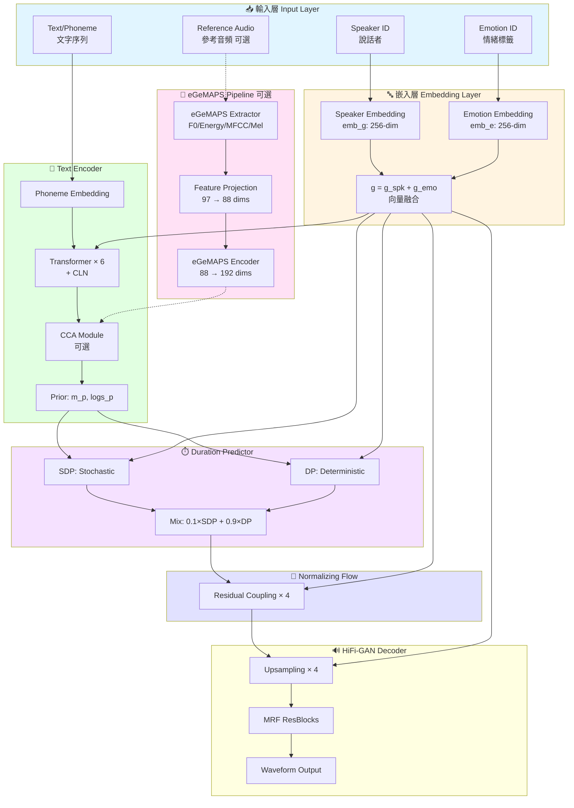
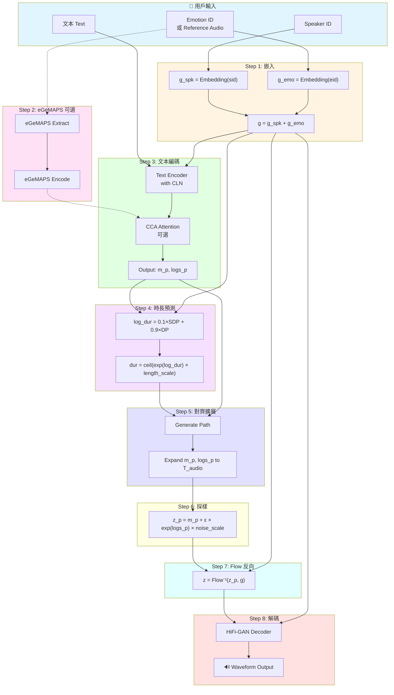
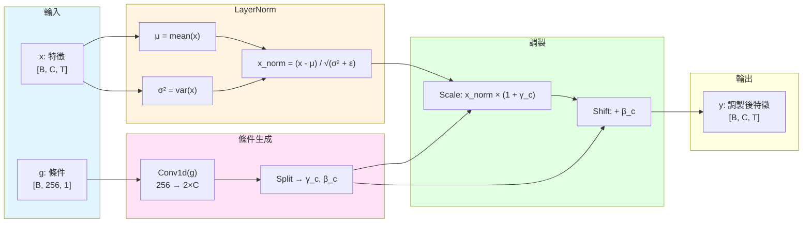
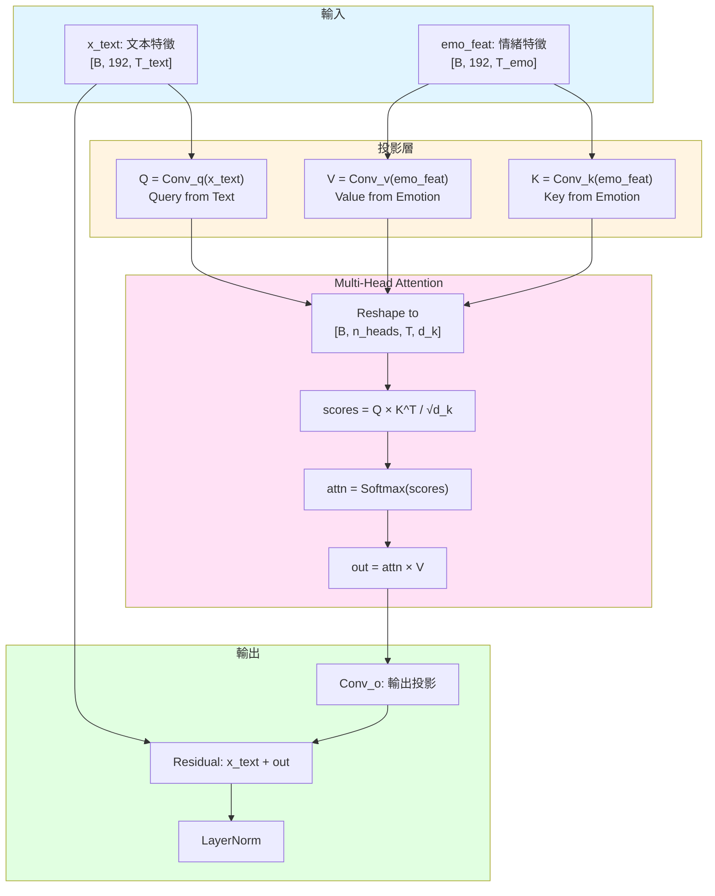
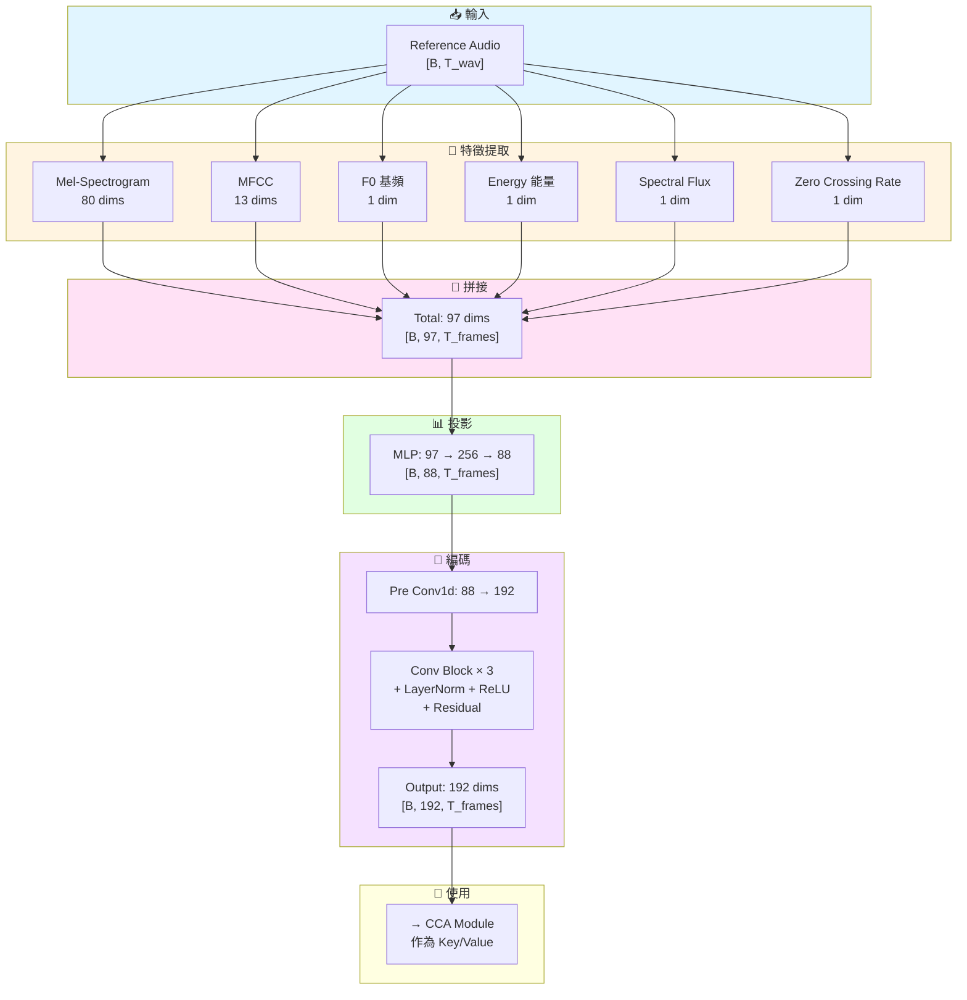
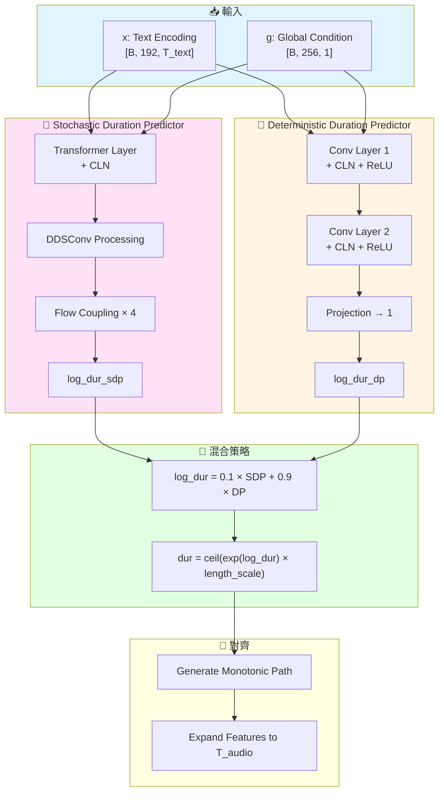
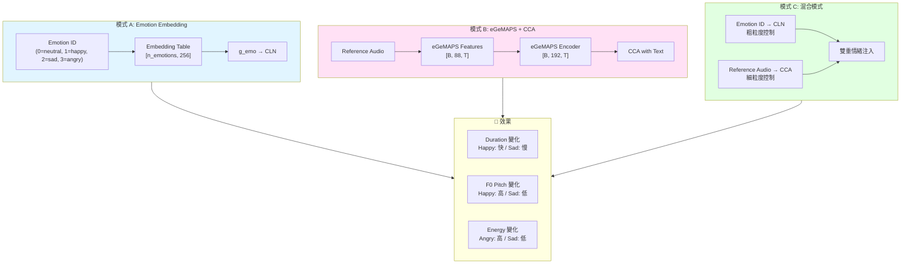
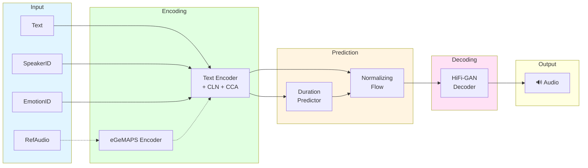
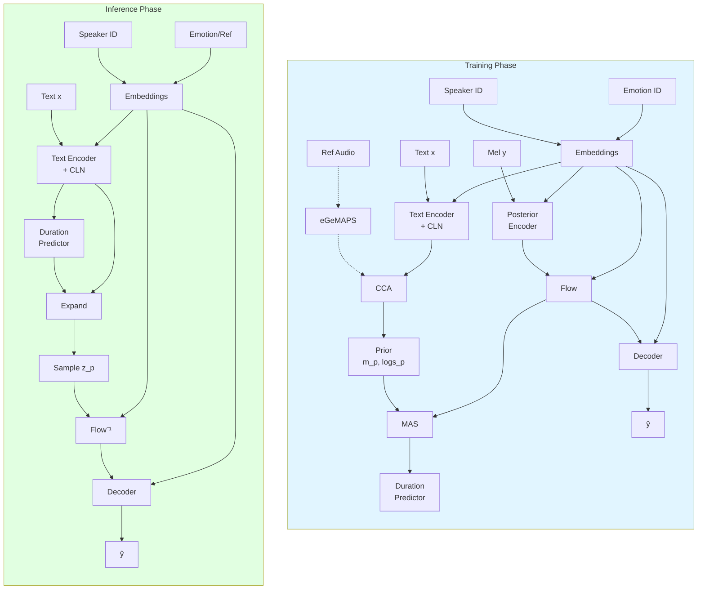

# Emotion-Controllable VITS - Flowchart 架構圖

> 📅 生成日期：2026-01-09  
> 🎯 用途：論文架構圖 (Mermaid Flowchart)

---

## 1. 完整系統架構 (System Overview)



---

## 2. 訓練流程 (Training Pipeline)

```mermaid
flowchart TB
    subgraph DataLoad["📂 數據載入"]
        DL1[(Filelist<br/>audio|sid|lang|text|eid)]
        DL2[TextAudioSpeakerLoader]
        DL3[Batch Collate]
    end

    subgraph Forward["⚡ 前向傳播"]
        FW1[Text Encoder<br/>+ CLN + CCA]
        FW2[Posterior Encoder<br/>Mel → z_q]
        FW3[Flow: z_q → z_p]
        FW4[MAS Alignment]
        FW5[Duration Prediction]
        FW6[HiFi-GAN Decode]
    end

    subgraph Loss["📉 損失計算"]
        L1["L_mel = ||Mel_real - Mel_fake||₁"]
        L2["L_kl = KL(z_q || z_p)"]
        L3["L_dur = MSE(log_dur)"]
        L4["L_adv = GAN Loss"]
        L5["L_fm = Feature Matching"]
        L6["L_total = L_mel×45 + L_kl + L_dur + L_adv + L_fm"]
    end

    subgraph Optim["🔄 優化"]
        O1[Generator Optimizer<br/>AdamW lr=2e-4]
        O2[Discriminator Optimizer<br/>AdamW lr=2e-4]
    end

    DL1 --> DL2 --> DL3
    DL3 --> FW1
    FW1 --> FW4
    FW2 --> FW3
    FW3 --> FW4
    FW4 --> FW5
    FW5 --> FW6

    FW6 --> L1
    FW3 --> L2
    FW5 --> L3
    FW6 --> L4
    FW6 --> L5
    L1 & L2 & L3 & L4 & L5 --> L6

    L6 --> O1
    L4 --> O2
    O1 & O2 -.->|迭代| FW1

    style DataLoad fill:#e1f5ff
    style Forward fill:#e1ffe1
    style Loss fill:#ffe1e1
    style Optim fill:#f5e1ff
```

---

## 3. 推論流程 (Inference Pipeline)



---

## 4. Conditional Layer Normalization (CLN) 機制



**數學公式：**
$$\text{CLN}(x, g) = (1 + \gamma_c) \odot \text{LN}(x) + \beta_c$$
$$[\gamma_c, \beta_c] = \text{Conv1D}(g)$$

---

## 5. Cross-Conditional Attention (CCA) 機制



**數學公式：**
$$\text{CCA}(x, c) = \text{LN}(x + \text{MultiHead}(Q, K, V))$$
$$Q = W_q \cdot x, \quad K = W_k \cdot c, \quad V = W_v \cdot c$$

---

## 6. eGeMAPS 特徵提取流程



---

## 7. Duration Prediction 機制



---

## 8. 情緒控制模式對比



---

## 9. 整體架構圖 (簡化版)



---

## 10. 論文用架構圖 (Paper-Ready)



---

*Generated: 2026-01-09*
