# VITS 情緒控制系統架構圖（論文用）

## 系統總覽

本文檔提供完整的 VITS 情緒控制系統架構流程圖，適用於論文撰寫。

---

## 1. 整體系統架構

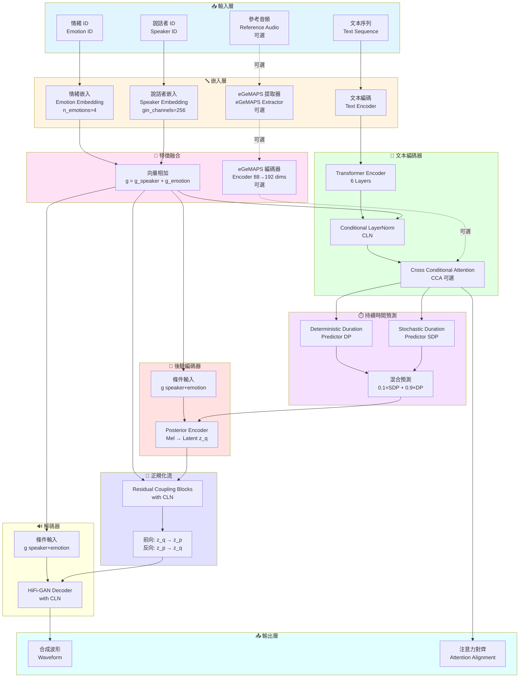

---

## 2. 訓練流程 (Training Pipeline)

```mermaid
flowchart TB
    subgraph Data["📂 數據載入"]
        D1[(Filelist<br/>audio|sid|lang|text|eid)]
        D2[TextAudioSpeakerLoader]
        D3[Batch Collate]
    end

    subgraph Input["📥 訓練輸入"]
        I1[文本 x]
        I2[Mel 頻譜 y]
        I3[說話者 ID sid]
        I4[情緒 ID eid]
    end

    subgraph Forward["⚡ 前向傳播"]
        F1[SynthesizerTrn.forward]
        F2[文本編碼 + CLN/CCA]
        F3[持續時間預測 + CLN]
        F4[Posterior 編碼]
        F5[Flow 正規化]
        F6[HiFi-GAN 解碼]
    end

    subgraph Loss["📉 損失計算"]
        L1[Duration Loss<br/>L_dur]
        L2[Mel Loss<br/>L_mel]
        L3[KL Divergence<br/>L_kl]
        L4[Adversarial Loss<br/>L_adv]
        L5[Feature Matching<br/>L_fm]
        L6[總損失<br/>L_total]
    end

    subgraph Optimize["🔄 優化"]
        O1[Generator 優化器]
        O2[Discriminator 優化器]
        O3[更新參數]
    end

    D1 --> D2
    D2 --> D3
    D3 --> I1 & I2 & I3 & I4

    I1 & I2 & I3 & I4 --> F1
    F1 --> F2 --> F3 --> F4 --> F5 --> F6

    F3 --> L1
    F6 --> L2
    F5 --> L3
    F6 --> L4 & L5

    L1 & L2 & L3 & L4 & L5 --> L6

    L6 --> O1 & O2
    O1 & O2 --> O3
    O3 -.迭代.-> F1

    style Data fill:#e1f5ff
    style Input fill:#fff4e1
    style Forward fill:#e1ffe1
    style Loss fill:#ffe1e1
    style Optimize fill:#f5e1ff
```

---

## 3. 推論流程 (Inference Pipeline)

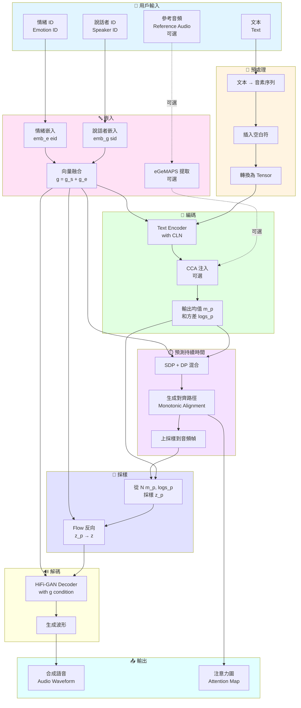

---

## 4. 情緒控制機制詳解

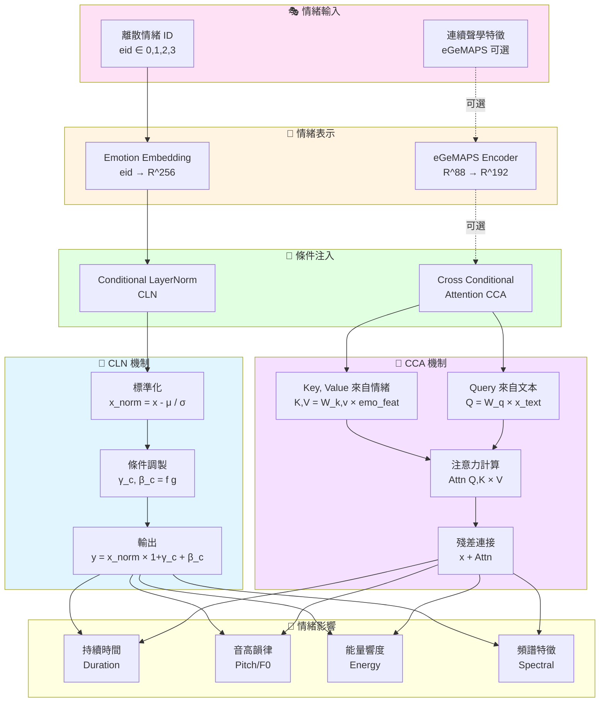

---

## 5. 條件層歸一化 (CLN) 詳細流程

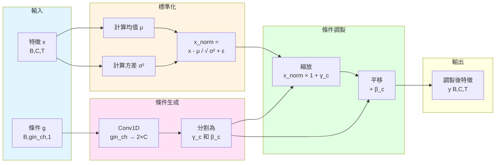

**數學公式**:

$$
\begin{align}
\text{CLN}(x, g) &= \gamma_c \odot \text{LN}(x) + \beta_c \\
[\gamma_c, \beta_c] &= \text{Conv1D}(g) \\
\text{LN}(x) &= \frac{x - \mu}{\sqrt{\sigma^2 + \epsilon}} \odot \gamma + \beta
\end{align}
$$

---

## 6. 交叉條件注意力 (CCA) 詳細流程

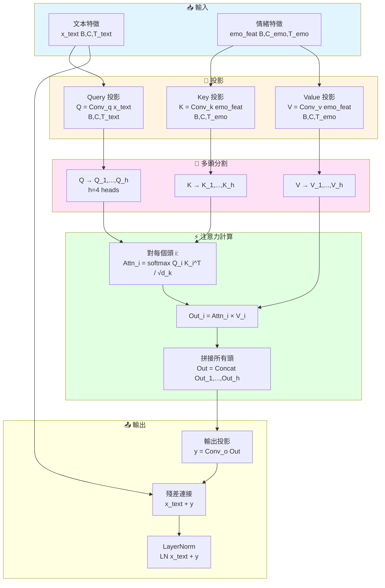

**數學公式**:

$$
\begin{align}
\text{CCA}(x, c) &= \text{LN}(x + \text{MultiHead}(Q, K, V)) \\
Q &= W_q x, \quad K = W_k c, \quad V = W_v c \\
\text{MultiHead}(Q,K,V) &= \text{Concat}(\text{head}_1, ..., \text{head}_h)W_o \\
\text{head}_i &= \text{Attention}(QW_i^Q, KW_i^K, VW_i^V) \\
\text{Attention}(Q,K,V) &= \text{softmax}\left(\frac{QK^T}{\sqrt{d_k}}\right)V
\end{align}
$$

---

## 7. 持續時間預測機制

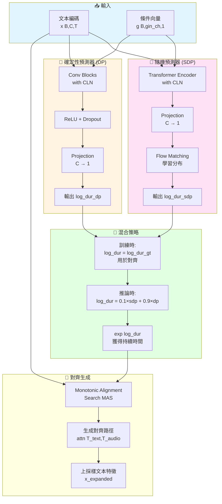

**情緒對持續時間的影響**:
- **Happy**: 持續時間 ↓ (語速快)
- **Sad**: 持續時間 ↑ (語速慢)
- **Angry**: 持續時間 ↓ (語速快、急促)
- **Neutral**: 基準持續時間

---

## 8. 數據流程

```mermaid
flowchart TB
    subgraph Raw["📂 原始數據"]
        R1[音頻檔案<br/>*.wav]
        R2[文本標註<br/>*.txt]
        R3[情緒標籤<br/>metadata]
    end

    subgraph Prepare["🔧 數據準備"]
        P1[音素化<br/>G2P]
        P2[情緒映射<br/>Label → ID]
        P3[生成 Filelist<br/>prepare_emotion_filelist.py]
    end

    subgraph Filelist["📋 Filelist"]
        F1[格式:<br/>path|sid|lang|phonemes|eid]
        F2[訓練集<br/>emotion_train.txt]
        F3[驗證集<br/>emotion_val.txt]
    end

    subgraph Loader["📥 數據載入"]
        L1[TextAudioSpeakerLoader]
        L2[讀取音頻]
        L3[計算 Mel 頻譜]
        L4[文本編碼]
    end

    subgraph Batch["📦 Batch 處理"]
        B1[BucketSampler<br/>相似長度分組]
        B2[TextAudioSpeakerCollate<br/>填充對齊]
        B3[輸出 Batch<br/>x,spec,wav,sid,eid]
    end

    subgraph Training["🎓 訓練"]
        T1[送入模型<br/>SynthesizerTrn]
    end

    R1 & R2 & R3 --> P1
    P1 --> P2
    P2 --> P3

    P3 --> F1
    F1 --> F2 & F3

    F2 & F3 --> L1
    L1 --> L2 & L3 & L4

    L2 & L3 & L4 --> B1
    B1 --> B2
    B2 --> B3

    B3 --> T1

    style Raw fill:#e1f5ff
    style Prepare fill:#fff4e1
    style Filelist fill:#ffe1f5
    style Loader fill:#e1ffe1
    style Batch fill:#f5e1ff
    style Training fill:#ffffe1
```

---

## 9. 模型組件層次結構

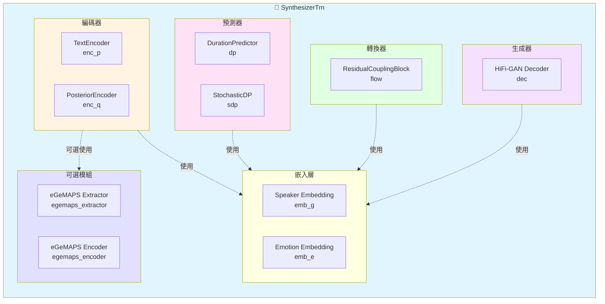

---

## 10. 情緒特徵提取 (eGeMAPS - 可選)

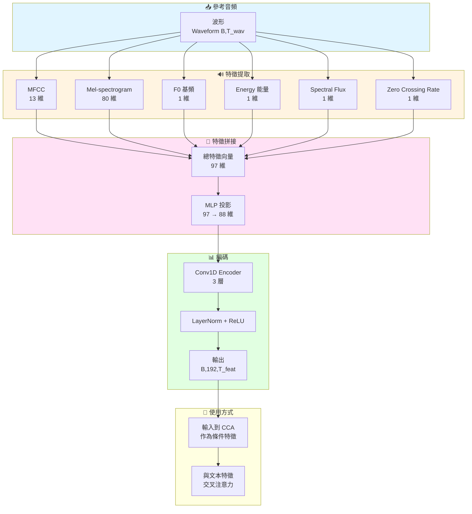

**注意**: 本實作使用純 Label ID，eGeMAPS 為可選增強功能。

---

## 11. 損失函數架構

```mermaid
flowchart TB
    subgraph Losses["💰 損失函數"]
        direction TB

        subgraph Generator["🎨 生成器損失"]
            G1[Duration Loss<br/>L_dur = MSE dur_pred, dur_gt]
            G2[Mel Loss<br/>L_mel = L1 mel_pred, mel_gt]
            G3[KL Divergence<br/>L_kl = KL z_p || z_q]
            G4[Adversarial Loss<br/>L_adv_g = -E log D y_fake]
            G5[Feature Matching<br/>L_fm = Σ ||f_real - f_fake||]
        end

        subgraph Discriminator["🔍 判別器損失"]
            D1[Real Loss<br/>L_real = -E log D y_real]
            D2[Fake Loss<br/>L_fake = -E log 1-D y_fake]
            D3[Total D Loss<br/>L_d = L_real + L_fake]
        end

        subgraph Total["📊 總損失"]
            T1[Generator Total<br/>L_g = L_dur + c_mel×L_mel +<br/>c_kl×L_kl + L_adv + L_fm]
            T2[權重<br/>c_mel=45, c_kl=1.0]
        end
    end

    G1 & G2 & G3 & G4 & G5 --> T1
    T2 -.配置.-> T1

    style Losses fill:#e1f5ff
    style Generator fill:#e1ffe1
    style Discriminator fill:#ffe1e1
    style Total fill:#ffffe1
```

**損失函數數學表達**:

$$
\begin{align}
\mathcal{L}_{\text{dur}} &= \text{MSE}(\log d_{\text{pred}}, \log d_{\text{gt}}) \\
\mathcal{L}_{\text{mel}} &= ||M_{\text{pred}} - M_{\text{gt}}||_1 \\
\mathcal{L}_{\text{kl}} &= \text{KL}(q(z|x) || p(z)) \\
\mathcal{L}_{\text{adv}} &= -\mathbb{E}[\log D(G(z))] \\
\mathcal{L}_{\text{fm}} &= \sum_{i=1}^{T} \frac{1}{N_i}||D^i(y) - D^i(\hat{y})||_1 \\
\mathcal{L}_{\text{G}} &= \mathcal{L}_{\text{dur}} + c_{\text{mel}}\mathcal{L}_{\text{mel}} + c_{\text{kl}}\mathcal{L}_{\text{kl}} + \mathcal{L}_{\text{adv}} + \mathcal{L}_{\text{fm}}
\end{align}
$$

---

## 12. 評估與測試流程

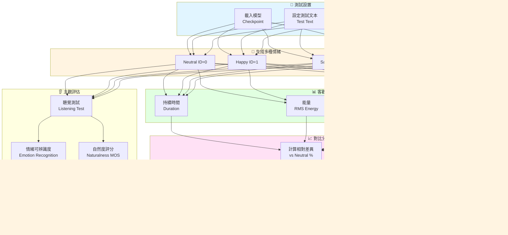

---

## 13. 完整系統資訊流

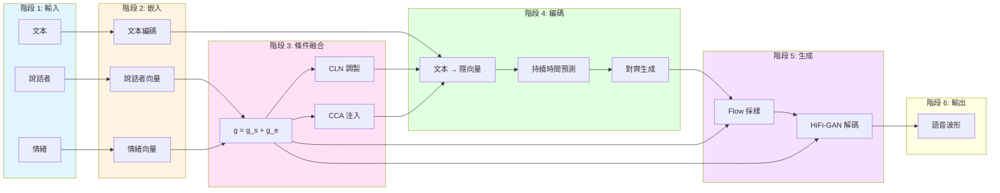

---

## 14. 代碼架構對應

### 核心文件映射

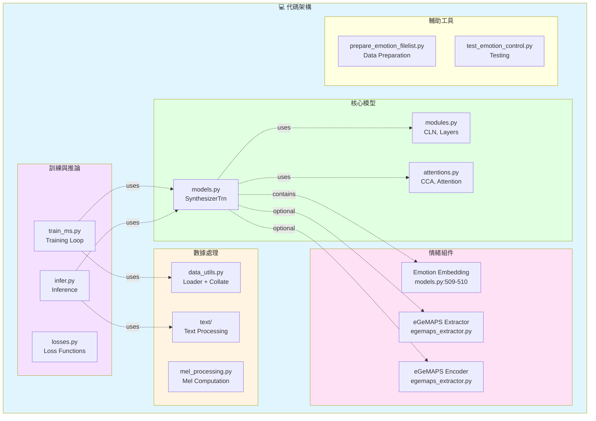

### 關鍵類別與方法

| 組件 | 文件位置 | 關鍵方法 |
|------|---------|---------|
| **SynthesizerTrn** | models.py:415-825 | `forward()`, `infer()` |
| **TextEncoder** | models.py:133-196 | `forward()` with CCA |
| **DurationPredictor** | models.py:80-130 | `forward()` with CLN |
| **ConditionalLayerNorm** | modules.py:34-75 | `forward()` |
| **CrossConditionalAttention** | attentions.py:257-345 | `forward()` |
| **eGeMAPS_Extractor** | egemaps_extractor.py:20-150 | `extract_*()`, `forward()` |
| **TextAudioSpeakerLoader** | data_utils.py:160-287 | `__getitem__()`, `_filter()` |

---

## 15. 論文圖表建議

### 建議的論文圖表順序

1. **系統總覽圖** (圖 1)
   - 使用「整體系統架構」流程圖
   - 展示完整的輸入到輸出流程

2. **情緒控制機制** (圖 2)
   - 使用「情緒控制機制詳解」
   - 重點標註 CLN 和 CCA

3. **CLN 架構** (圖 3)
   - 使用「條件層歸一化詳細流程」
   - 配合數學公式

4. **CCA 架構** (圖 4)
   - 使用「交叉條件注意力詳細流程」
   - 展示多頭注意力機制

5. **訓練流程** (圖 5)
   - 使用「訓練流程」
   - 標註損失函數

6. **推論流程** (圖 6)
   - 使用「推論流程」
   - 展示用戶如何控制情緒

7. **實驗結果** (表格)
   - 客觀指標對比表
   - 主觀評估 MOS 表

### LaTeX 圖表引用範例

```latex
\begin{figure}[htbp]
\centering
\includegraphics[width=\linewidth]{emotion_control_architecture.pdf}
\caption{VITS 情緒控制系統整體架構。系統接收文本、說話者 ID 和情緒 ID 作為輸入，通過 Conditional LayerNorm (CLN) 和 Cross Conditional Attention (CCA) 機制將情緒信息注入到模型各層，最終生成具有指定情緒的語音波形。}
\label{fig:system_overview}
\end{figure}
```

---

## 16. 關鍵技術貢獻

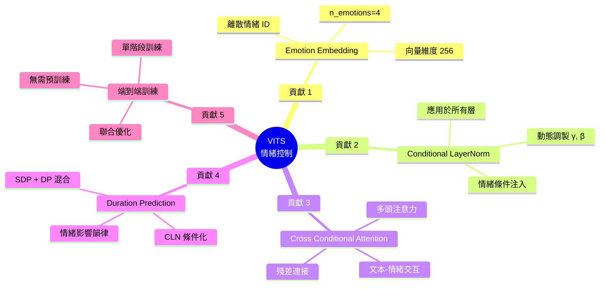

---

## 參考文獻建議

### 相關工作

1. **VITS**: Kim et al., "Conditional Variational Autoencoder with Adversarial Learning for End-to-End Text-to-Speech", ICML 2021

2. **Conditional LayerNorm**: Dumoulin et al., "A Learned Representation for Artistic Style", ICLR 2017

3. **Emotion TTS**:
   - Skerry-Ryan et al., "Towards End-to-End Prosody Transfer for Expressive Speech Synthesis with Tacotron", ICML 2018
   - Valle et al., "Flowtron: an Autoregressive Flow-based Generative Network for Text-to-Speech Synthesis", ICLR 2021

4. **eGeMAPS**: Eyben et al., "The Geneva Minimalistic Acoustic Parameter Set (GeMAPS) for Voice Research and Affective Computing", IEEE Trans. Affective Computing, 2016

---

## 附錄：符號表

| 符號 | 說明 | 維度 |
|------|------|------|
| $x$ | 文本序列 | $[B, T_{text}]$ |
| $y$ | 音頻波形 | $[B, T_{audio}]$ |
| $\text{sid}$ | 說話者 ID | $[B]$ |
| $\text{eid}$ | 情緒 ID | $[B]$ |
| $g$ | 全局條件向量 | $[B, 256, 1]$ |
| $z$ | 隱變量 | $[B, 192, T]$ |
| $m_p, \log s_p$ | 先驗均值、方差 | $[B, 192, T]$ |
| $m_q, \log s_q$ | 後驗均值、方差 | $[B, 192, T]$ |
| $d$ | 持續時間 | $[B, T_{text}]$ |
| $C$ | 隱藏維度 | 192 |
| $C_{gin}$ | 條件維度 | 256 |

---

**本架構圖使用 Mermaid 語法生成，可在支援 Mermaid 的 Markdown 編輯器中渲染，或使用工具轉換為 PDF/PNG 格式用於論文。**
